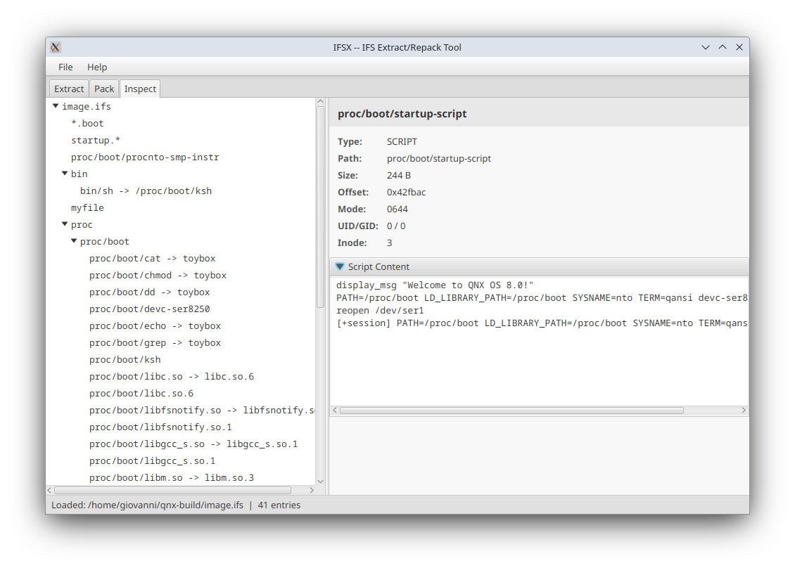

# IFSX -- IFS Extract/Repack Tool

Cross-platform tool for inspecting, extracting, and repacking QNX IFS
(Image Filesystem) images. Wraps the official QNX SDP tools.



## Modules

- **ifsx-core** — library (parsing, extraction, buildfile generation)
- **ifsx-cli** — command line interface (Linux + Windows via jpackage)
- **ifsx-gui** — JavaFX desktop application
- **ifsx-web** — servlet for Tomcat

## Requirements

- Java 17+
- QNX SDP configured and sourced

## Build all

    ./gradlew clean release

## CLI

On Linux this produces a `.deb`. On Windows a `.msi`.
The `.deb` installs the binary to `/opt/ifsx/bin/ifsx` with a symlink at
`/usr/local/bin/ifsx` and the manpage at `/usr/share/man/man1/ifsx.1.gz`.

## GUI

See [ifsx-gui/docs/user-guide.md](ifsx-gui/docs/user-guide.md) for usage.

## Hooks

User-defined hook executables can run before or after each operation.
Place executables in the appropriate subdirectory of `~/.ifsx/`:

```
~/.ifsx/
    pre-extract/    run before extraction
    post-extract/   run after extraction
    pre-pack/       run before packing
    post-pack/      run after packing
```

Each hook receives the IFS path and the directory as positional arguments.
A non-zero exit code aborts the operation.

CLI usage: `--pre-extract`, `--post-extract`, `--pre-pack`, `--post-pack` (repeatable, run in given order).

GUI: checkboxes in the Extract and Pack tabs (alphabetical order).

### Extracting nested IFSes

A funny post-extract `recursive.sh` hook to extract nested IFSes in one pass:
```sh
#!/bin/sh
set -e
for file in `find $2 -name "*.ifs"`; do 
    echo "Extract $file in ${file}_extracted"
    ifsx extract $file --post-extract=recursive.sh ${file}_extracted
done
```

## Configuration

Remember to source the SDP before using the cli or the gui.

## License

Apache License 2.0
